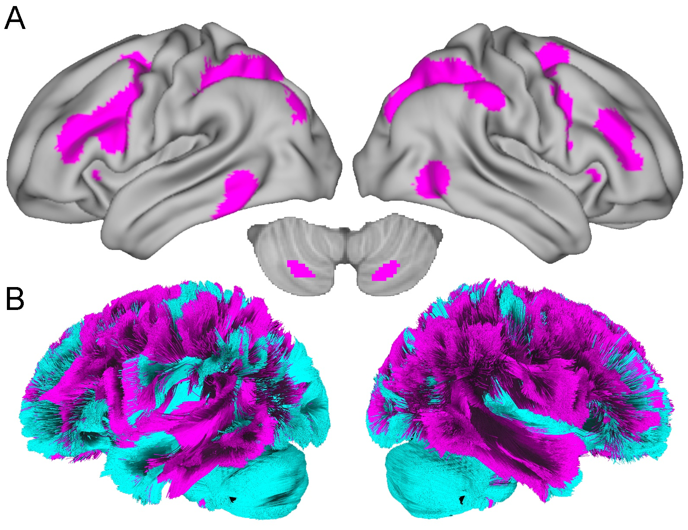
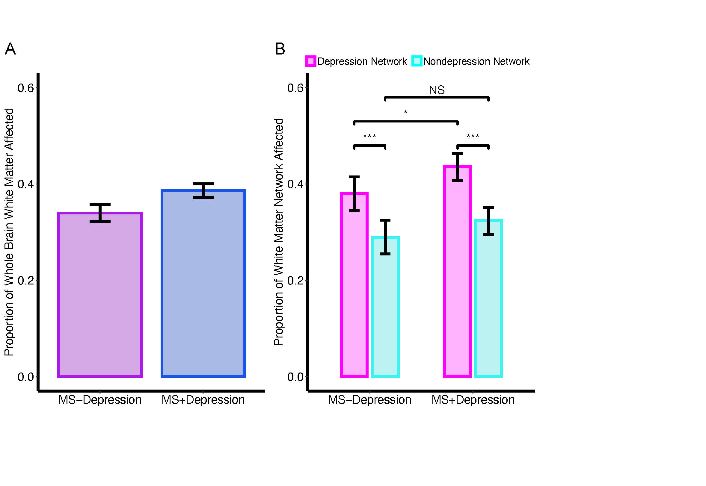
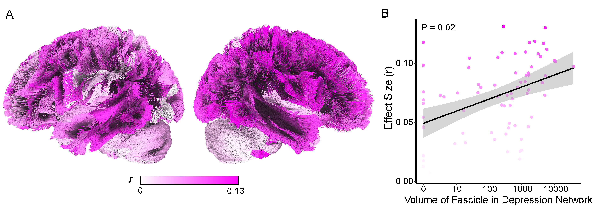

 
 

### Project Lead
Erica B. Baller

### Faculty Leads
Theodore D. Satterthwaite and Russell T. Shinohara

### Brief Project Description:
380 participants with multiple sclerosis were included (MS+Depression=232, MS-Depression=148). Lesions from research-grade clinical scans were segmented with MIMoSA and normalized to the HCP template. Streamline filtering was performed in DSI studio to generate measures of the degree of fascicle and network impact by lesions. A white matter depression network than connected previously described gray matter regions associated with depression (Siddiqi et al., 2021) was constructed. Main effect of network, depression diagnosis, and diagnosis by network interactions were assessed. 

### Analytic Replicator:
Elizabeth Sweeney, Ph.D.

### Collaborators:
Erica B. Baller, M.D., M.S., Elizabeth M. Sweeney, Ph.D., Amit Bar-Or, M.D., Matthew C. Cieslak, Ph.D., Sydney C. Covitz, B.A., John A. Detre, M.D., Ameena Elahi, Abigail R. Manning, B.A., Clyde E. Markowitz, Melissa Martin, B.A., Christopher M. Perrone, M.D., Victoria Rautman, Timothy Robert-Fitzgerald, B.A., Matthew K. Schindler, M.D., Ph.D., Shan Siddiqi, M.D., Sunil Thomas, Michael D. Fox, M.D., Ph.D., Russell T. Shinohara, Ph.D.^, Theodore D. Satterthwaite, M.D., M.A.^
^shared last author 

### Project Start Date:
1/2021

### Current Project Status:
Completed

### Dataset:
Multiple Sclerosis Cohort

### Github repo:
https://github.com/PennLINC/msdepression

### Website
https://pennlinc.github.io/msdepression/

### Path to data on filesystem:
PMACS:/project/msdepression/ 

### Slack Channel:
#msdepression and #msminigroup

### Zotero library:
K23 MS and Depression 

### Current work products:
ECTRIMS Poster 10/27/2022 - "Characterizing the relationship between white matter lesions and depression in patients with multiple sclerosis."

ACNP Poster 12/8/2022 - "Depression as a disease of white matter network disruption: characterizing the relationship between white matter lesions and depression in patients with multiple sclerosis."

### Path to Data on Filesystem **PMACS**

All clinical data was drawn from the electronic medical record via the Data Acquisition Center (DAC). All images were obtained from the PACS system from the Department of Radiology.

DAC Pull: 

     /project/msdepression/data/erica_dac_pull/investigatingdepressioninmspatients_dates_right_format.csv
 
Psychiatry medication information: 

     /project/msdepression/drugs_data/nami_psych_meds_antidepressants.csv

Patients with parsable depression diagnosis (after incorporating medications):

     /project/msdepression/drugs_data/parsable_msdepression.csv *fed into R analysis*

Subject imaging data: 

     /project/msdepression/data/subj_directories

Cubids : 

     /project/msdepression/cubids/v1_validation.csv
     /project/msdepression/CuBIDS_outputs/*
     
MIMoSA QA info:

     /project/msdepression/data/melissa_martin_files/csv/mimosa_dataframe

Fascicle proportions (for each subject (one row), % of injured fascicle (each column is a fascicle)): 

     /project/msdepression/results/fascicle_volumes_all_subjects_roi_n2336.csv

Overlap of each fascicle (volume and proportion) with depression network: 

     /project/msdepression/results/streamline_volume_within_dep_network_3_09.csv

Volume of all lesions (NOT fascicles) for each subject: 

     /project/msdepression/results/mimosa_binary_masks_hcp_space_20211026_n2336_volumes.csv

Volume of each healthy (full volume) fascicle: 

     /project/msdepression/templates/dti/HCP_YA1065_tractography/fiber_volume_values.csv
     
Individual Healthy Fascicle Maps (.nii)

     /project/msdepression/templates/dti/HCP_YA1065_tractography<association,cerebellum,commissural,projection>

Harvard Depression Mask (thresholded 3.09, binarized)

     /project/msdepression/templates/harvard_depression/Dep_clust_T_3_09_binarized.nii

HCP template:

    /project/msdepression/templates/mni_icbm152_t1_tal_nlin_asym_09a.nii 
    /project/msdepression/templates/mni_icbm152_t1_tal_nlin_asym_09axbrainmask.nii

 
 

# CODE DOCUMENTATION

**The analytic workflow implemented in this project is described in detail in the following sections. Analysis steps are described in the order they were implemented; the script(s) used for each step are identified and links to the code on github are provided.** 
 

### * Functions for project *
[msdepression_functions.R](https://github.com/PennLINC/msdepression/blob/gh-pages/msdepression_functions.R)

### Sample Construction

We first constructed our sample from n=890 individuals who were diagnosed with multiple sclerosis by a Multiple Sclerosis provider and received their clinical scans at the University of Pennsylvania. 

The following code takes the n=890 sample, and goes through a variety of exclusions to get the final n. Specifically, after excluding participants with poor image quality (n = 107), 783 were eligible for depression classification.  Inclusion in the depression group (MS+Depression) required 1) an ICD-10 depression diagnosis (F32-F34.\*), 2) a prescription for antidepressant medication, or screening positive via Patient Health Questionairre-2(PHQ2) or -9(PHQ9). The age- and sex-matched nondepressed comparators (MS-Depression) included persons with 1) no prior depression diagnosis, 2) no psychiatric medications, and 3) were asymptomatic on PHQ2/9. 
  
### Automated white matter lesion segmentation

After we obtained our sample, we used the Method for Intermodal Segmentation Analysis (MIMoSA) to extract white matter lesions for each subject. MIMoSA has been previously described: 

Valcarcel AM, Linn KA, Vandekar SN, Satterthwaite TD, Muschelli J, Calabresi PA, Pham DL, Martin ML, Shinohara RT. MIMoSA: An Automated Method for Intermodal Segmentation Analysis of Multiple Sclerosis Brain Lesions. J Neuroimaging. 2018 Jul;28(4):389-398. [doi: 10.1111/jon.12506](https://pubmed.ncbi.nlm.nih.gov/29516669/). Epub 2018 Mar 8. PMID: 29516669; PMCID: PMC6030441.

### Streamline Filtering
Streamline filtering is an interative process performed in DSI studio. HCP template fib file can be found here [dsistudio Download: HCP1065 1-mm FIB file](https://brain.labsolver.org/hcp_template.html). Template is based on [HCP 2009a asymmetric](https://www.bic.mni.mcgill.ca/~vfonov/icbm/2009/).

For each individual, the MIMoSA binary map was considered a region of interest. For each of the 77 fascicles, streamlines that ran through the lesion were "filtered" or kept, whereas the fascicles that avoided the MIMoSA mask were eliminated. Streamlines that passed through the MIMoSA map were then saved binary .nii files, where 1 indicated that disease was present in that voxel, and 0 indicated either 1) that fascicle did not cross through that voxel or 2) there was no disease in it. 
  
I was then able to calculate the "volume" of the disease in a fascicle (i.e. volume of the streamlines that were affected) by summing the # of 1s in the map. At the end, each individual had 77 single values that represented the volume of affected streamlines within each fascicle.
  
Full fascicle volumes were also calculated and saved as .niis. 

#### Step 1: Registering/normalizing MIMoSA binary maps to HCP template

[ants_registration_code.sh](https://github.com/PennLINC/msdepression/blob/gh-pages/ants_registration_code.sh)

#### Step 2: Take a subject's MIMoSA lesions and generate the fiber tracts (individual fascicles) that run through it

*Script that cycles through all subjects to do streamline filtering*

[dsi_studio_bash.sh](https://github.com/PennLINC/msdepression/blob/gh-pages/dsi_studio_bash.sh)

*Individual subject streamline filtering, called from dsi_studio_bash*

[indiv_mimosa_lesion_dsi_studio_script.sh](https://github.com/PennLINC/msdepression/blob/gh-pages/indiv_mimosa_lesion_dsi_studio_script.sh)

#### Step 3: Calculate the volume of each fascicle in a template (healthy) brain

*Make the volume of each of the healthy fascicles*

[make_streamline_volumes_for_template.sh](https://github.com/PennLINC/msdepression/blob/gh-pages/make_streamline_volumes_for_template.sh)

*Calculate the volume within each healthy fascicle*

[get_volume_of_mimosa_lesions.sh](https://github.com/PennLINC/msdepression/blob/gh-pages/get_volume_of_mimosa_lesions.sh)

#### Step 4: Calculate the volume of the fiber tracts that are impaired

*Make streamline volumes for all subjects*

[streamline_volumes_all_subjs.sh](https://github.com/PennLINC/msdepression/blob/gh-pages/streamline_volumes_all_subjs.sh)

*Make streamline volumes for a single subject, called from streamline_volumes_all_subjs.sh*

[make_streamline_volumes_single_subj_pmacs.sh](https://github.com/PennLINC/msdepression/blob/gh-pages/make_streamline_volumes_single_subj_pmacs.sh)

*If you want to calculate the volume of the MIMoSA lesions irrespective of the streamlines they affect*

[get_volume_of_mimosa_lesions.sh](https://github.com/PennLINC/msdepression/blob/gh-pages/get_volume_of_mimosa_lesions.sh)

#### Step 5: Generate summary fascicle measures

This specifically makes the fascicle injury ratio measure, calculated by taking the volume of injured fascicle and dividing by the overall volume of the healthy fascicle. 

[roi_ratio_regressions.R](https://github.com/PennLINC/msdepression/blob/gh-pages/roi_ratio_regressions.R)

#### White matter depression network construction

This network was made by [Shan Siddiqi et al., 2021 *Nature Human Behavior*](https://www.nature.com/articles/s41562-021-01161-1). 

I first thresholded the mask (3.09), binarized it and then used it as an ROI and calculated, per fascicle, the volume occupied by the fascicle that intersected with the depression mask using streamline filtering as above.

[calc_vol_fascicles_within_depression_mask_3_09.sh](https://github.com/PennLINC/msdepression/blob/gh-pages/calc_vol_fascicles_within_depression_mask_3_09.sh)

The top 25% (top quartile), i.e. the top 25% of fascicles with the highest volume of network overlap were considered in the depression network. Everything outside of that was considered "non_depression" network. In total, 77 fascicles were evaluated.

#### Disease burden summary measures
  Having computed disease measures at the individual fascicle, I wanted to assess network effects for all future analyses. To do this, I calculated three summary measures per individual. 
    
    1) Total disease : Sum of all 77 volume measures of disease, divided by the total volume of "healthy" fascicles (i.e. taking a sum of all of the full fascicle volumes). This yields a proportion of the overall burden of disease in the brain
    
    2) Depression network: Sum of all 19 volume measures of disease in the fascicles within the depression network, divided by the sum of total full fascicle volumes in the depression network.
    
    3) Nondepression network: Sum of all 58 volume measures of disease in the fascicles outside the depression network, divided by the sum of total full fascicle volumes in the nondepression network.
    
#### Main effect of Network, Diagnosis, and Diagnosis\*Network Analyses

A linear mixed effects model was used to assess main effect of Network, Diagnosis, and Diagnosis\*Network interactions with subject as a repeated measure using [lme4](https://cran.r-project.org/web/packages/lme4/index.html). 

#### Individual Fascicle Analyses 

Given the somewhat arbitrary definition of depression network (25%/75%), we next assessed whether the relationship between diagnosis and network was continuous. 
  
    1) For each fascicle, two values were computed
    
      a) Effect size (r) from the wilcoxon statistic comparing volume of disease in the fascicle between depressed vs nondepressed individuals
    
      b) The volume of the overlap of that fascicle with the depression network
  
    2) A linear model relating the overlap of volume of the fascicle w/the depression network to the effect size from the depressed v nondepressed wilcoxon analysis.

#### Coloring scripts for fascicle visualizations (to be fed into DSI studio)

*Sample script for making RGB scales in the red to yellow range*

[make_red_to_yellow_RGB_color_scheme.R](https://github.com/PennLINC/msdepression/blob/gh-pages/make_red_to_yellow_RGB_color_scheme.R)

*Sample script for making binary color schemes, simple*

[make_binary_colored_depression_net_maps.R](https://github.com/PennLINC/msdepression/blob/gh-pages/make_binary_colored_depression_net_maps.R)

*Sample script for making binary color schemes, coloring by whether fascicle in vs. outside dep network*

[make_binary_colored_depression_net_maps_by_dx.R](https://github.com/PennLINC/msdepression/blob/gh-pages/make_binary_colored_depression_net_maps_by_dx.R)

### Final group level analysis

This script is run locally, on R. It does all second level/group data analysis. 

[msdepression_n380_started_20230113_post_replication_just_simple_mm.Rmd](https://github.com/PennLINC/msdepression/blob/gh-pages/msdepression_n380_started_20230113_post_replication_just_simple_mm.Rmd)

### Final Figures

#### **Figure 2 - Depression network**

#### **Figure 3 - Main Effect of Network**

#### **Figure 4 - Main Effect of Depression Diagnosis and Diagnosis * Network Interaction**

#### **Figure 5 - Fascicle Effects**

